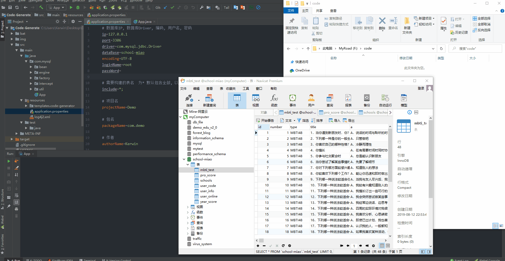
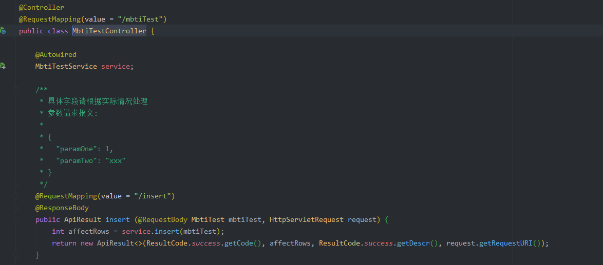
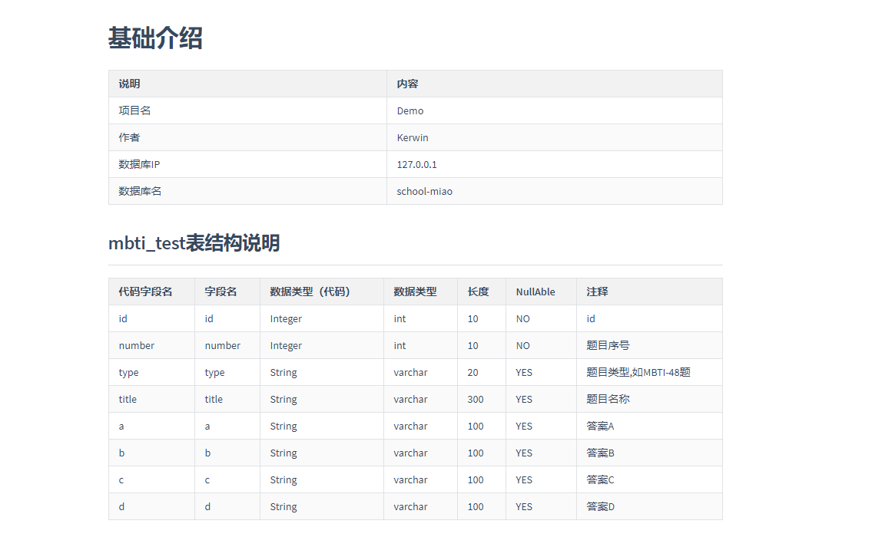
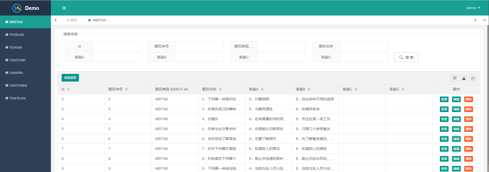

#  [Code-Generate](https://github.com/kkzhilu/Code-Generate) 代码生成器

## 简介

 🚀  Code-Generate是一个基于原生Mysql & SpringBoot & Mybatis 的代码生成器，建表之后即可完全解放双手，1秒钟构建CRUD接口以及漂亮的LayUi前端界面，同时支持```在不改动任何老代码的情况下拓展新的模板```，适合：

- 规律性定制化开发
- 解放劳动力，一键完成固有代码
- 原生mybatis.xml以及SpringBoot，简单Demo的学习利器
- 允许开发者继承接口实现自定义文件内容，阅读简单开源项目的首选
- 测试同学的测试Demo案例，1秒钟造一个，就说快不快
- 学生党快速交作业（咳咳咳，如果你是该类，一定要关注加点赞啊！）


## 效果演示




步骤说明：

1. 自行建立数据库及需要映射的数据表
2. 打开Code-Generate，进行基础的配置，如项目名，作者名，输出地址，应用哪些模板等等
3. 运行App.java核心类，即得到了最终的项目
4. 运行生成的项目即可


## 使用说明

该项目为普通Java项目，依赖的环境有：

- JDK
- MySQL
- Maven
- Lombok插件


|      可配置项       |          说明           |
| :-----------------: | :---------------------: |
|         ip          |         IP地址          |
|        port         |         端口号          |
|       driver        |          驱动           |
|      dataBase       |         数据库          |
|      encoding       |          编码           |
|      loginName      |      数据库用户名       |
|      passWord       |       数据库密码        |
|       include       | 包括哪些表，默认*; 全部 |
|     projectName     |        项目名称         |
|     packageName     |       自定义包名        |
|     authorName      |  作者名称（用作注释）   |
|      rootPath       |        输出路径         |
| customHandleInclude | 自定义模板，默认*;全部  |


```Main方法 @see App.java```

```java
public class App {
    /***
     * 执行 - 构建项目
     */
    public static void main(String[] args){
        AbstractEngine engine = AbstractEngine.init();
        engine.execute();
    }
}
```

> 生成的结果是一个Maven项目，直接用IDE打开即可


## 现有模块

- 基础的接口访问
- 基于MD的数据库字段文档
- 基于LayUi的前端展示模块

如下图所示：

**接口访问**




**MD的数据库字段文档**




**LayUi的前端展示模块**




## 技术细节

```本项目主要的核心即两个通过mysql内置的表字段查询配合FreeMaker模板，构建具有一定规律性，通用的代码内容```

- FreeMaker  DefaultEngine.java process方法
- mybatis 原生XML，包含增，批量增，删，批量删，多条件分页查询，列表查询，单一查询，单一数据修改等
- logback日志
- SpringBoot
- 拔插式拦截器（基于org.reflections实现），支持扫描指定接口


## 协议

### GNU General Public License v3.0


## 最后

该项目是从无到有一点点构建出来的，适合初学者和刚入门的人进行学习，更加适合大佬们直接快速构建简单Demo，把时间花在更有价值的事情上，欢迎各位Star & Fork.


点我：[GitHub地址]( https://github.com/kkzhilu/Code-Generate/tree/master )

